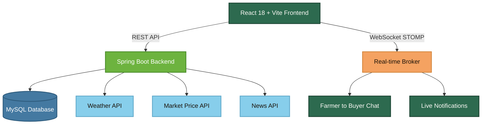

<p align="center">
  
</p>

<p align="center">
  <em>India's farm-to-buyer trade and decision platform : direct sourcing, mandi prices, weather insights, and real-time negotiation. No middlemen. No markups.</em>
</p>

<div align="center">

  [](LICENSE)
  
  
  
  
  
  

  
  
  
  

</div>

---

<div align="center">

[](https://d3bnt1t6yx1asq.cloudfront.net)

</div>

---

## 🌍 Project Overview

In India, farmers receive as little as 30–40% of the final price a buyer pays and the rest is absorbed by middlemen, commission agents, and logistics brokers. AagriGgate eliminates that chain entirely.

AagriGgate is a full-stack agriculture trade and decision-support platform where farmers list crops and buyers purchase directly with real-time chat, live mandi prices, and weather-driven decisions built in. No agents. No markups. No information asymmetry.

**What the platform offers:**

- Direct farmer-to-buyer trading with no commission
- Crop listing, request management, and in-app negotiation
- Real-time chat between farmers and buyers post-acceptance
- Live mandi (APMC) market prices and historical trends
- Hyperlocal weather data for harvest and selling decisions
- Agriculture news and updates
- Urgent crop and waste crop selling to reduce post-harvest losses
- Real-time notifications throughout the trade journey
---

## ⚠️ The Problem We Solve

In traditional agricultural trade, multiple intermediaries sit between the farmer and the buyer such as commission agents, brokers, and logistics middlemen where each taking a cut. The result: farmers receive a fraction of the final price, buyers overpay, and neither side has access to reliable market data when it matters.

AagriGgate addresses this by giving both sides a direct, data-informed trading environment:

- No commission agents or hidden fees
- Open and Transparent MarketPlace
- OTP and JWT-based secure authentication
- Role-based dashboards for farmers and buyers
- Crop listing, search, filter, and cart workflow
- Buyer request and approach system
- Weather and live mandi price integration
- Real-time chat and notifications throughout the trade journey

---

## 🏗️ System Architecture

### Architecture flow



### Layers

| Layer | Technology | Responsibility |
|:------|:-----------|:---------------|
| Client | React + Vite | UI and API interaction |
| API layer | Spring Boot | REST endpoints |
| Service layer | Spring Boot | Business logic |
| Security layer | Spring Security + JWT | Authentication and authorization |
| Persistence layer | Spring Data JPA | Database operations |
| Database | MySQL | Data storage |
| External services | Weather API, Market API | External data |

---

## 🛠️ Tech Stack

<div align="center">
  
</div>

<br/>

<table align="center">
  <tr>
    <th>Backend</th>
    <th>Frontend</th>
  </tr>
  <tr>
    <td>
      Java 21<br/>
      Spring Boot<br/>
      Spring Security<br/>
      Spring Data JPA (Hibernate)<br/>
      Maven<br/>
      JWT Authentication<br/>
      Spring Mail (OTP)
    </td>
    <td>
      React 18<br/>
      Vite<br/>
      React Router<br/>
      Axios<br/>
      CSS
    </td>
  </tr>
  <tr>
    <th colspan="2">Database</th>
  </tr>
  <tr>
    <td colspan="2" align="center">
      MySQL &nbsp;|&nbsp; Flyway (production migrations)
    </td>
  </tr>
</table>

---

## ✨ Core Features

**Authentication & Security**

- Farmer and buyer registration with OTP verification
- Password login and OTP-based login
- Forgot password flow with OTP reset
- JWT-based authentication and role-based authorization

**Farmer**

- Add, update, and delete crop listings with image uploads
- Mark crops as urgent, waste, available, or sold
- Set discount prices on listings
- View, accept, or reject incoming buyer requests
- Look up hyperlocal weather and live mandi prices
- Real-time chat with buyers and instant notifications

**Buyer**

- Browse, search, filter, and sort crop listings
- Add crops to cart or favorites
- Send purchase requests and track them end to end
- Checkout cart with bulk request support
- Real-time chat with farmers and instant notifications

**Platform**

- Paginated and filterable API responses with DTO-based design
- Separate image endpoints for optimized delivery
- Scheduled cleanup jobs for OTP and stale data
- Real-time WebSocket communication and notification delivery system
- Fully responsive UI

---

## 🔄 USER FLOW

### 🌾 Farmer Flow

```
Register ──▶ ✉️ Verify OTP ──▶ 🔐 Login ──▶ 🌱 Add Crop ──▶ 📩 Buyer Request ──▶ 💬 Chat ──▶ ✅ Accept ──▶ 🏆 Sold!
```

### 🛒 Buyer Flow

```
Register ──▶ ✉️ Verify OTP ──▶ 🔐 Login ──▶ 🔍 Browse ──▶ 🛒 Cart ──▶ 📨 Request ──▶ 💬 Chat ──▶ ✅ Accepted ──▶ 🎉 Done!
```

---

## 🗄️ Database Design

### Main tables

| Table | Description |
|:------|:------------|
| `farmer` | Farmer accounts and profiles |
| `buyer` | Buyer accounts and profiles |
| `crop` | Crop listings with details |
| `cart_item` | Buyer cart entries |
| `favorite` | Buyer saved favorites |
| `approach_farmer` | Buyer-to-farmer requests |
| `saved_market_data` | Saved market price records |
| `enquiry` | Help and support enquiries |
| `login_otp` | Login OTP tokens |
| `registration_otp` | Registration OTP tokens |
| `password_reset_otp` | Password reset OTP tokens |
| `notification` | System notifications |
| `chat_message` | Chat conversation messages |

### Relationships

| Relationship | Type |
|:-------------|:-----|
| One farmer → many crops | `1:N` |
| One buyer → many cart items | `1:N` |
| One buyer → many favorites | `1:N` |
| One buyer → many approaches | `1:N` |
| One crop → many approaches | `1:N` |
| Farmer ↔ buyer chat messages | `M:N` |

---

## 🌐 API Overview

**Authentication**

| Method | Endpoint |
|:-------|:---------|
| POST | `/api/v1/auth/register` |
| POST | `/api/v1/auth/login` |
| POST | `/api/v1/auth/otp-login` |
| POST | `/api/v1/auth/forgot-password` |
| POST | `/api/v1/auth/reset-password` |

**Crops**

| Method | Endpoint |
|:-------|:---------|
| POST | `/api/v1/crops` |
| GET | `/api/v1/crops` |
| GET | `/api/v1/crops/{id}` |
| PUT | `/api/v1/crops/{id}` |
| DELETE | `/api/v1/crops/{id}` |

**Cart**

| Method | Endpoint |
|:-------|:---------|
| GET | `/api/v1/cart` |
| POST | `/api/v1/cart/add` |
| DELETE | `/api/v1/cart/remove` |
| POST | `/api/v1/cart/checkout` |

**Favorites**

| Method | Endpoint |
|:-------|:---------|
| POST | `/api/v1/favorites` |
| GET | `/api/v1/favorites` |
| DELETE | `/api/v1/favorites/{id}` |

**Approaches**

| Method | Endpoint |
|:-------|:---------|
| POST | `/api/v1/approach` |
| GET | `/api/v1/approach/buyer` |
| GET | `/api/v1/approach/farmer` |
| PUT | `/api/v1/approach/{id}/accept` |
| PUT | `/api/v1/approach/{id}/reject` |

**Market and weather**

| Method | Endpoint |
|:-------|:---------|
| GET | `/api/v1/market/prices` |
| GET | `/api/v1/weather` |

**Chat and notifications**

| Method | Endpoint |
|:-------|:---------|
| GET | `/api/v1/chat` |
| POST | `/api/v1/chat/send` |
| GET | `/api/v1/notifications` |
| PUT | `/api/v1/notifications/read` |
---

## 🚀 LOCAL SETUP

### 📋 Prerequisites

* ☕ Java 21
* 📦 Node.js
* 📦 npm
* 📦 Maven
* 🐬 MySQL

### ⚙️ Run Backend

```bash
cd backend
./mvnw spring-boot:run
```

Backend URL:

```text
http://localhost:8080/api/v1
```

### ⚛️ Run Frontend

```bash
cd frontend
npm install
npm run dev
```

Frontend URL:

```text
http://localhost:5173
```

---

## 🔑 ENVIRONMENT VARIABLES

```env
SPRING_PROFILES_ACTIVE=dev
SERVER_PORT=8080

DB_URL=jdbc:mysql://localhost:3306/app
DB_USERNAME=root
DB_PASSWORD=replace_me

EMAIL_USERNAME=your-email@example.com
EMAIL_PASSWORD=replace_me

APP_SECURITY_USER=dev-user
APP_SECURITY_PASSWORD=replace_me

JWT_SECRET=base64_encoded_32_byte_secret_here

MARKET_API_INGEST_ON_STARTUP=false
MARKET_API_STARTUP_STATE=Karnataka
MARKET_API_STARTUP_DISTRICT=Bangalore

WEATHER_API_URL=https://api.weatherapi.com/v1/current.json
WEATHER_API_KEY=replace_me

MARKET_API_URL=https://api.data.gov.in/resource/35985678-0d79-46b4-9ed6-6f13308a1d24
MARKET_API_KEY=replace_me

NEWS_GNEWS_URL=https://gnews.io/api/v4
NEWS_API_KEY=replace_me

ADMIN_USERNAME=admin
ADMIN_PASSWORD=replace_me

APP_CORS_ALLOWED_ORIGINS=http://localhost:3000,http://localhost:5173,http://localhost:5174

NEWS_API_CLEANUP_CRON=0 0 0 * * *
NEWS_API_QUOTA_RESET_CRON=0 0 0 * * *
NEWS_API_SCHEDULER_CRON=0 0 0 * * *
MARKET_API_INGESTION_CRON=0 0 9 * * *
OTP_CLEANUP_CRON=0 */5 * * * *
```

---

## ☁️ DEPLOYMENT

| Component | Platform |
|:----------|:---------|
| 🖥️ Backend | AWS EC2 |
| 🌐 Frontend | AWS CloudFront |
| 🗄️ Database | MySQL |


### 🔗 Live URLs

* 🚀 [https://d3bnt1t6yx1asq.cloudfront.net](https://d3bnt1t6yx1asq.cloudfront.net)


---

## 👥 CONTRIBUTORS

<div align="center">
  <table>
    <tr>
      <td align="center">
        <a href="https://github.com/B-Vighnesh">
          
          <br/>
          <sub><b>B. Vighnesh Kumar</b></sub>
        </a>
        <br/><br/>
        <a href="https://github.com/B-Vighnesh">
          
        </a>
      </td>
      <td align="center">
        <a href="https://github.com/Joylan9">
          
          <br/>
          <sub><b>Joylan Dsouza</b></sub>
        </a>
        <br/><br/>
        <a href="https://github.com/Joylan9">
          
        </a>
      </td>
    </tr>
  </table>

  <br/>
  <em>Made with ❤️ for Indian Farmers</em>
</div>

---

## 📄 LICENSE

This project is licensed under the MIT License.

---

<div align="center">
  ⭐ Star this repo if AagriGgate inspired you &nbsp;|&nbsp; 🍴 Fork it &nbsp;|&nbsp; 🐛 Open Issues
</div>

<br/>

<p align="center">
  
</p>
