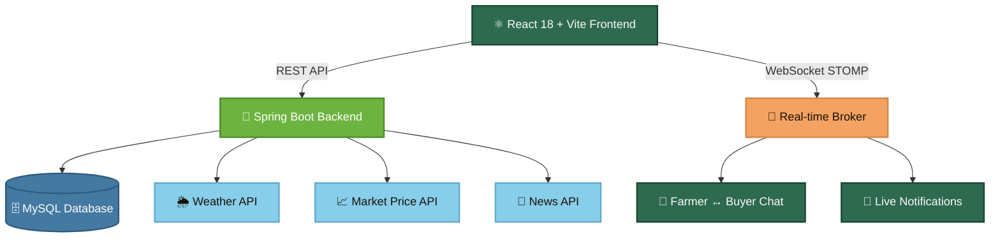

<p align="center">
  
</p>

<p align="center">
  <em>🌾 India's direct agriculture marketplace — empowering farmers, eliminating middlemen, maximizing profits.</em>
</p>

<div align="center">

  [](LICENSE)
  
  
  
  
  
  

  
  
  
  

</div>

---

<div align="center">

  [](https://d3bnt1t6yx1asq.cloudfront.net)


</div>

---

## 🌍 PROJECT OVERVIEW

In India, farmers receive as little as 30–40% of the final price a buyer pays — the rest is absorbed by middlemen, commission agents, and logistics brokers. AagriGgate eliminates that chain entirely.
AagriGgate is a full-stack agriculture marketplace where farmers list crops and buyers purchase directly — with real-time chat, live market prices, and weather-driven decisions built in. No agents. No markups. No information asymmetry.

AagriGgate enables:

* 🤝 Direct farmer-to-buyer trading
* 🌱 Crop listing and request management
* 💬 Real-time chat between farmers and buyers
* 🔔 Real-time notifications system
* 📊 Data-driven decision making using:

  * 📈 Market price data
  * 🌦️ Weather information
  * 📰 Agriculture-related updates

The platform also includes features such as urgent crop selling and waste crop selling to help reduce crop wastage and improve selling efficiency.

---

## ⚠️ PROBLEM STATEMENT

Traditional agriculture marketplaces involve multiple intermediaries, which:

* 📉 Reduce farmer profits
* 💸 Increase buyer costs
* 🚫 Limit access to real-time data

This system addresses these issues by enabling:

* 🤝 Direct interaction between farmers and buyers
* 📊 Access to real-time market and weather data
* 🧠 Improved decision-making and communication

---

## 💡 SOLUTION

AagriGgate provides:

* 🏪 Direct farmer-to-buyer marketplace
* 🌾 Crop listing and management
* 🔍 Buyer search, filter, and cart workflow
* 📨 Request/approach system
* 📱 OTP-based authentication
* 🔐 JWT-based authorization
* 🌦️ Weather and market price integration
* 💬 Real-time chat functionality
* 🔔 Real-time notifications
* 🎯 Role-based dashboards

---

## 🏗️ SYSTEM ARCHITECTURE

### Architecture Flow



### 📐 Layers

| Layer | Technology | Responsibility |
|:------|:-----------|:---------------|
| 🖥️ Client | React + Vite | UI and API interaction |
| 🔌 API Layer | Spring Boot | REST endpoints |
| ⚙️ Service Layer | Spring Boot | Business logic |
| 🔒 Security Layer | Spring Security + JWT | Authentication and authorization |
| 💾 Persistence Layer | Spring Data JPA | Database operations |
| 🗄️ Database | MySQL | Data storage |
| 🌐 External Services | Weather API, Market API | External data |

---

## 🛠️ TECH STACK

<div align="center">
  

</div>

<br/>

<table align="center">
  <tr>
    <th>☕ Backend</th>
    <th>⚛️ Frontend</th>
  </tr>
  <tr>
    <td>
      ☕ Java 21<br/>
      🍃 Spring Boot<br/>
      🛡️ Spring Security<br/>
      💾 Spring Data JPA (Hibernate)<br/>
      📦 Maven<br/>
      🔐 JWT Authentication<br/>
      ✉️ Spring Mail (OTP)
    </td>
    <td>
      ⚛️ React 18<br/>
      ⚡ Vite<br/>
      🧭 React Router<br/>
      🌐 Axios<br/>
      🎨 CSS
    </td>
  </tr>
  <tr>
    <th colspan="2">🗄️ Database</th>
  </tr>
  <tr>
    <td colspan="2" align="center">
      🐬 MySQL &nbsp;|&nbsp; 🔄 Flyway (Production migrations)
    </td>
  </tr>
</table>

---

## ✨ CORE FEATURES

<details>
<summary>🔐 <b>Authentication & Security</b></summary>
<br/>

* ✅ Seller and buyer registration
* ✅ OTP verification
* ✅ Password login
* ✅ OTP login
* ✅ Forgot password with OTP
* ✅ JWT-based authentication
* ✅ Role-based authorization

</details>

<details>
<summary>🧑‍🌾 <b>Farmer Features</b></summary>
<br/>

* ✅ Add, update, delete crops
* ✅ Upload crop images
* ✅ Mark crops (urgent, waste, available, sold)
* ✅ Set discount price
* ✅ View buyer requests
* ✅ Accept/reject requests
* ✅ Weather lookup
* ✅ Market price lookup and save
* ✅ Real-time buyer chat
* ✅ Instant notifications

</details>

<details>
<summary>🛒 <b>Buyer Features</b></summary>
<br/>

* ✅ Browse crops
* ✅ Search crops
* ✅ Filter and sort crops
* ✅ Add to favorites
* ✅ Add to cart
* ✅ Send purchase request
* ✅ Checkout cart
* ✅ Track requests
* ✅ Real-time farmer chat
* ✅ Instant notifications

</details>

<details>
<summary>🏗️ <b>Platform Features</b></summary>
<br/>

* ✅ Pagination
* ✅ Filtering and sorting
* ✅ DTO-based API responses
* ✅ Separate image endpoints
* ✅ Scheduled cleanup jobs
* ✅ Responsive UI
* ✅ Real-time communication system
* ✅ Notification delivery system

</details>

---

## 🔄 USER FLOW

### 🌾 Farmer Flow

```
Register ──▶ ✉️ Verify OTP ──▶ 🔐 Login ──▶ 🌱 Add Crop ──▶ 📩 Buyer Request ──▶ 💬 Chat ──▶ ✅ Accept ──▶ 🏆 Sold!
```

### 🛒 Buyer Flow

```
Register ──▶ ✉️ Verify OTP ──▶ 🔐 Login ──▶ 🔍 Browse ──▶ 🛒 Cart ──▶ 📨 Request ──▶ 💬 Chat ──▶ ✅ Accepted ──▶ 🎉 Done!
```

---

## 🗄️ DATABASE DESIGN

### 📋 Main Tables

| Table | Description |
|:------|:------------|
| 🧑‍🌾 `farmer` | Farmer accounts and profiles |
| 🛒 `buyer` | Buyer accounts and profiles |
| 🌾 `crop` | Crop listings with details |
| 🛍️ `cart_item` | Buyer cart entries |
| ❤️ `favorite` | Buyer saved favorites |
| 🤝 `approach_farmer` | Buyer-to-Farmer requests |
| 📈 `saved_market_data` | Saved market price records |
| ❓ `enquiry` | Help & support enquiries |
| 🔑 `login_otp` | Login OTP tokens |
| 📝 `registration_otp` | Registration OTP tokens |
| 🔓 `password_reset_otp` | Password reset OTP tokens |
| 🔔 `notification` | System notifications |
| 💬 `chat_message` | Chat conversation messages |

### 🔗 Relationships

| Relationship | Type |
|:-------------|:-----|
| 🧑‍🌾 One Farmer → Many Crops | `1:N` |
| 🛒 One Buyer → Many Cart Items | `1:N` |
| ❤️ One Buyer → Many Favorites | `1:N` |
| 🤝 One Buyer → Many Approaches | `1:N` |
| 🌾 One Crop → Many Approaches | `1:N` |
| 💬 Farmer ↔ Buyer Chat Messages | `M:N` |

---

## 🌐 API OVERVIEW

<details>
<summary>🔐 <b>Authentication</b></summary>
<br/>

*  `/api/v1/auth/register`
*  `/api/v1/auth/login`
*  `/api/v1/auth/otp-login`
*  `/api/v1/auth/forgot-password`
*  `/api/v1/auth/reset-password`

</details>

<details>
<summary>🌾 <b>Crops</b></summary>
<br/>

*  `/api/v1/crops`
*  `/api/v1/crops`
*  `/api/v1/crops/{id}`
*  `/api/v1/crops/{id}`
*  `/api/v1/crops/{id}`

</details>

<details>
<summary>🛒 <b>Cart</b></summary>
<br/>

*  `/api/v1/cart`
*  `/api/v1/cart/add`
*  `/api/v1/cart/remove`
*  `/api/v1/cart/checkout`

</details>

<details>
<summary>❤️ <b>Favorites</b></summary>
<br/>

*  `/api/v1/favorites`
*  `/api/v1/favorites`
*  `/api/v1/favorites/{id}`

</details>

<details>
<summary>🤝 <b>Approaches</b></summary>
<br/>

*  `/api/v1/approach`
*  `/api/v1/approach/buyer`
*  `/api/v1/approach/farmer`
*  `/api/v1/approach/{id}/accept`
*  `/api/v1/approach/{id}/reject`

</details>

<details>
<summary>📊 <b>Market & Weather</b></summary>
<br/>

*  `/api/v1/market/prices`
*  `/api/v1/weather`

</details>

<details>
<summary>💬 <b>Chat & Notifications</b></summary>
<br/>

*  `/api/v1/chat`
*  `/api/v1/chat/send`
*  `/api/v1/notifications`
*  `/api/v1/notifications/read`

</details>

---

## 🚀 LOCAL SETUP

### 📋 Prerequisites

* ☕ Java 21
* 📦 Node.js
* 📦 npm
* 📦 Maven
* 🐬 MySQL

### ⚙️ Run Backend

```bash
cd backend
./mvnw spring-boot:run
```

Backend URL:

```text
http://localhost:8080/api/v1
```

### ⚛️ Run Frontend

```bash
cd frontend
npm install
npm run dev
```

Frontend URL:

```text
http://localhost:5173
```

---

## 🔑 ENVIRONMENT VARIABLES

```env
SPRING_PROFILES_ACTIVE=dev
SERVER_PORT=8080

DB_URL=jdbc:mysql://localhost:3306/app
DB_USERNAME=root
DB_PASSWORD=replace_me

EMAIL_USERNAME=your-email@example.com
EMAIL_PASSWORD=replace_me

APP_SECURITY_USER=dev-user
APP_SECURITY_PASSWORD=replace_me

JWT_SECRET=base64_encoded_32_byte_secret_here

MARKET_API_INGEST_ON_STARTUP=false
MARKET_API_STARTUP_STATE=Karnataka
MARKET_API_STARTUP_DISTRICT=Bangalore

WEATHER_API_URL=https://api.weatherapi.com/v1/current.json
WEATHER_API_KEY=replace_me

MARKET_API_URL=https://api.data.gov.in/resource/35985678-0d79-46b4-9ed6-6f13308a1d24
MARKET_API_KEY=replace_me

NEWS_GNEWS_URL=https://gnews.io/api/v4
NEWS_API_KEY=replace_me

ADMIN_USERNAME=admin
ADMIN_PASSWORD=replace_me

APP_CORS_ALLOWED_ORIGINS=http://localhost:3000,http://localhost:5173,http://localhost:5174

NEWS_API_CLEANUP_CRON=0 0 0 * * *
NEWS_API_QUOTA_RESET_CRON=0 0 0 * * *
NEWS_API_SCHEDULER_CRON=0 0 0 * * *
MARKET_API_INGESTION_CRON=0 0 9 * * *
OTP_CLEANUP_CRON=0 */5 * * * *
```

---

## ☁️ DEPLOYMENT

| Component | Platform |
|:----------|:---------|
| 🖥️ Backend | AWS EC2 |
| 🌐 Frontend | AWS CloudFront |
| 🗄️ Database | MySQL |


### 🔗 Live URLs

* 🚀 [https://d3bnt1t6yx1asq.cloudfront.net](https://d3bnt1t6yx1asq.cloudfront.net)


---

## 👥 CONTRIBUTORS

<div align="center">
  <table>
    <tr>
      <td align="center">
        <a href="https://github.com/B-Vighnesh">
          
          <br/>
          <sub><b>B. Vighnesh Kumar</b></sub>
        </a>
        <br/><br/>
        <a href="https://github.com/B-Vighnesh">
          
        </a>
      </td>
      <td align="center">
        <a href="https://github.com/Joylan9">
          
          <br/>
          <sub><b>Joylan Dsouza</b></sub>
        </a>
        <br/><br/>
        <a href="https://github.com/Joylan9">
          
        </a>
      </td>
    </tr>
  </table>

  <br/>
  <em>Made with ❤️ for Indian Farmers</em>
</div>

---

## 📄 LICENSE

This project is licensed under the MIT License.

---

<div align="center">
  ⭐ Star this repo if AagriGgate inspired you &nbsp;|&nbsp; 🍴 Fork it &nbsp;|&nbsp; 🐛 Open Issues
</div>

<br/>

<p align="center">
  
</p>
